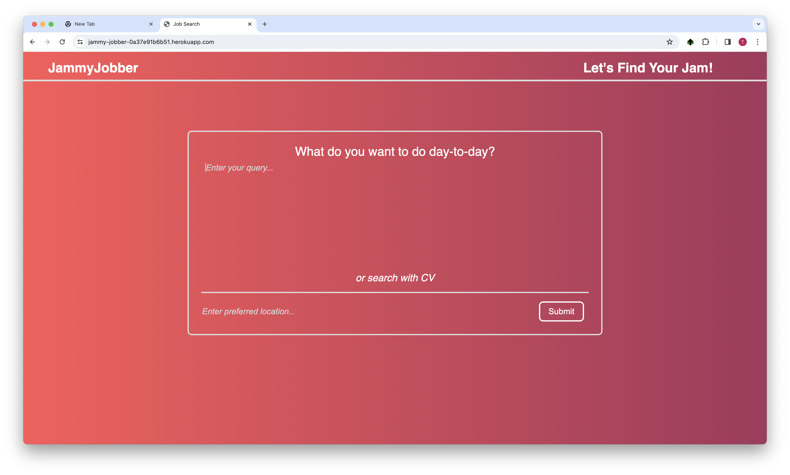
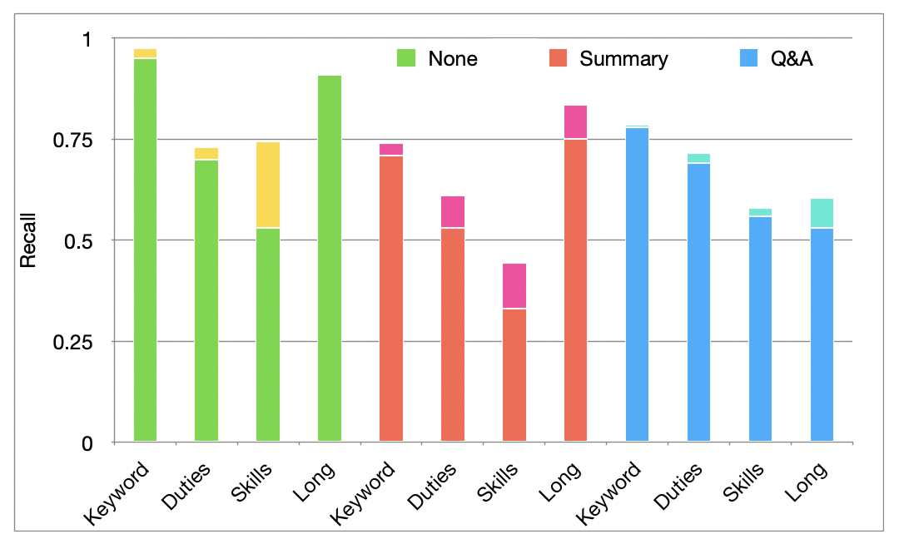

<!-- PROJECT LOGO -->
<br />
<div align="center">
  <a href="https://github.com/github_username/repo_name">
    
  </a>

<h3 align="center">JammyJobber</h3>

  <p align="center">
    Neural Network Job Search using LLM
  </p>
</div>

[Check out the website](https://jammy-jobber-0a37e91b6b51.herokuapp.com/)

## About The Project



Welcome to JammyJobber, the next generation of job search powered by language models! In this project, we aim to address the limitations of traditional keyword-based job search methods and provide a more effective and intuitive way for job seekers to find relevant opportunities.

The problem with keyword job search is its reliance on exact matches, leading to missed opportunities and frustration for job seekers. Our target user is anyone frustrated with the inefficiency of traditional keyword-based job search methods and seeking a better solution.
We're leveraging the power of language models to understand the nuanced needs and preferences of job seekers, resulting in more accurate and personalized job recommendations. By embedding job postings and queries in a vector space, we can provide tailored recommendations based on skills and experience.

## Technical Implementation & Database Manegement

We preprocess and embed each job posting and query in a vector space to model similarities. Our architecture involves Python, Django, JavaScript, and RESTful APIs. We host models on a digital server and use Transformers.js for client-side processing to balance response time and accuracy.
We store job embeddings in SemaDB and metadata in SQLite databases. Keeping them separate allows for easier management and scalability, enabling us to work with multiple models simultaneously.

### Built With

- Python
- Django
- JavaScript
- RESTful APIs
- Transformers.js

## Evaluation



We evaluated our project by comparing the results of several searches against keyword search to ensure that our search performs at least as well as searching by keywords. Additionally, we manually reviewed the results of each search to identify jobs surfaced by our search that were good matches for the query but were not found by keyword search.

#### Evaluation Queries

We created three sets of queries to assess our performance:

1. Keyword Search-Equivalent: Queries structured similarly to typical keyword searches (e.g., "I want to be a nurse").
2. Skills-Based: Queries describing the candidate's skills and qualifications (e.g., "I'm trained in providing medical care").
3. Duties-Based: Queries describing features of the desired role (e.g., "I want to look after people and provide assistance").

#### Model Comparison

We compared the performance of three different language models for processing jobs and user queries:

1. No Model: The full text is directly embedded into our vector database.
2. Summarization Model: A straightforward model that summarizes the text before embedding.
3. Question and Answer Model: We ask the model to describe the main skills and interests mentioned in the query.

#### Models used

1. Sentence-transformers/all-minilm-L12-V2 · hugging face [Internet]. [cited 2024 Feb 28]. Available from: https://huggingface.co/sentence-transformers/all-MiniLM-L12-v2 
2. Falconsai/text_summarization · hugging face [Internet]. [cited 2024 Feb 28]. Available from: https://huggingface.co/Falconsai/text_summarization 
3. Deepset/Roberta-base-squad2 · hugging face [Internet]. [cited 2024 Feb 28]. Available from: https://huggingface.co/deepset/roberta-base-squad2 

### Results

Our evaluation demonstrates that our search tool performs comparably to keyword search and provides additional benefits, such as surfacing relevant jobs not found by traditional methods. With further refinement and development, our search tool has the potential to revolutionize the job search process for users.

## Getting started

To get started with JammyJobber, follow the instructions below.

### Prerequisites

- Python (version 3.8 or higher (3.11 not recommended yet))
- Django (version 4.1 or higher)
- JavaScript
- See requirements.txt for the full list of dependencies
- Browser supporting Transformer.js (see the documentation for more details: 
  https://huggingface.co/docs/transformers.js/en/index)
- RapidAPI account with semaDB subscription (see the documentation for more details:
  https://rapidapi.com/semafind-semadb/api/semadb/details)
- Running LLM-server (see the link for more details: 
  https://github.com/Manavjain1104/llm-server)

### Installation

1. Clone the repo

```sh
  git clone https://github.com/Manavjain1104/jammyjobber.git
```

2. Install Python packages

```sh
  pip install -r requirements.txt
```

4. Create a .env file with your secret keys

```
RAPID_API_KEY=<your rapid api key (with your semaDB subscription, see the semaDB link above for more details)>
RAPID_API_HOST="semadb.p.rapidapi.com" 
LLM_SERVER_ADDRESS=<your LLM-server host>
```

5. Create a semaDB collection to store job embeddings

```python
  python -c 'from utils.semadb_utils import *; create_collection(COLLECTION_NAME, EMBEDDING_SIZE)'
```

6. Populate the job listing into databases (SemaDB and SQLite) 
   (Note: some code in main utils/integration_utils.py needs to be uncommented to populate the database from scratch)

```python
  python utils/integration_utils.py
```

7. Run Django server

```python
  python manage.py runserver
```

8. Visit the website

```
http://127.0.0.1:8000/
```

9. Add more jobs, using web_scraper/scraper_gov.py and utils/integration_utils.py to scrape more jobs from
   https://findajob.dwp.gov.uk

## Usage

JammyJobber provides a user-friendly interface for job seekers to search for relevant job opportunities based on their skills and experience.

## Roadmap

Our future plans for JammyJobber include:

- Use more fine-tuned models for job search and consider using larger (paid) models
- Automate job scraping and migrate to another database
- Switch to other (non-free) resources, which is easy due to the modularity of our codebase

## Contributing

Contributions are what make the open-source community such an amazing place to learn, inspire, and create. Any contributions you make are greatly appreciated.

1. Fork the Project
2. Create your Feature Branch (git checkout -b feature/AmazingFeature)
3. Commit your Changes (git commit -m 'Add some AmazingFeature')
4. Push to the Branch (git push origin feature/AmazingFeature)
5. Open a Pull Request

## Authors and acknowledgment

This project was created as part of third year group project SEGP in Computing, Imperial College London

- Manav Jain (mj921)
- Krish Maha (krm221)
- Shruti Pradhan (sp1521)
- Max Stupple (mes21)
- Tina Wang (tw1720)
- Kristina Zimina (kz1021)

## License

Distributed under the MIT License

## Acknowledgments

Special thanks to our supervisor, Nuri Cingillioglu, and all contributors who helped make JammyJobber possible!
We couldn't have done it without you!
